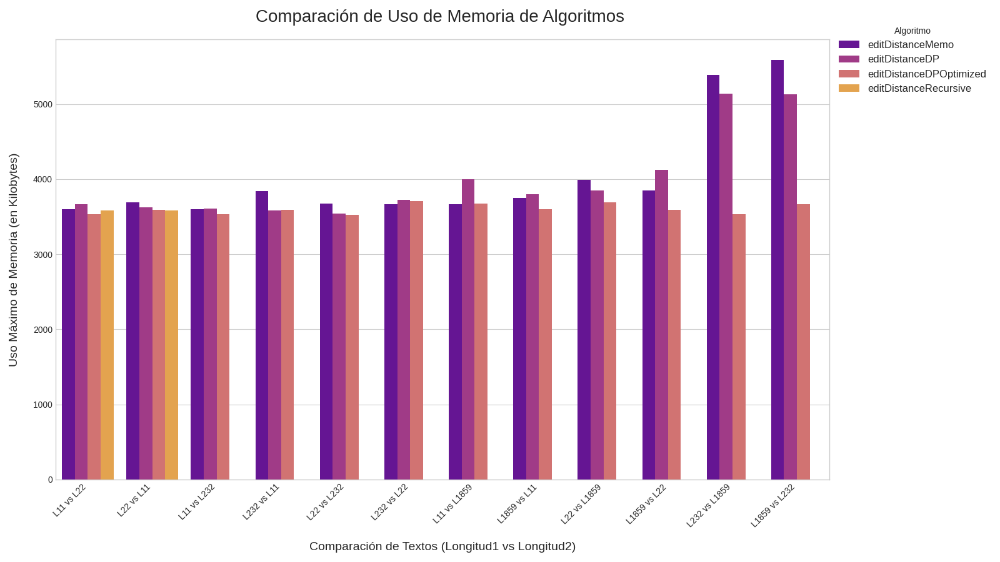
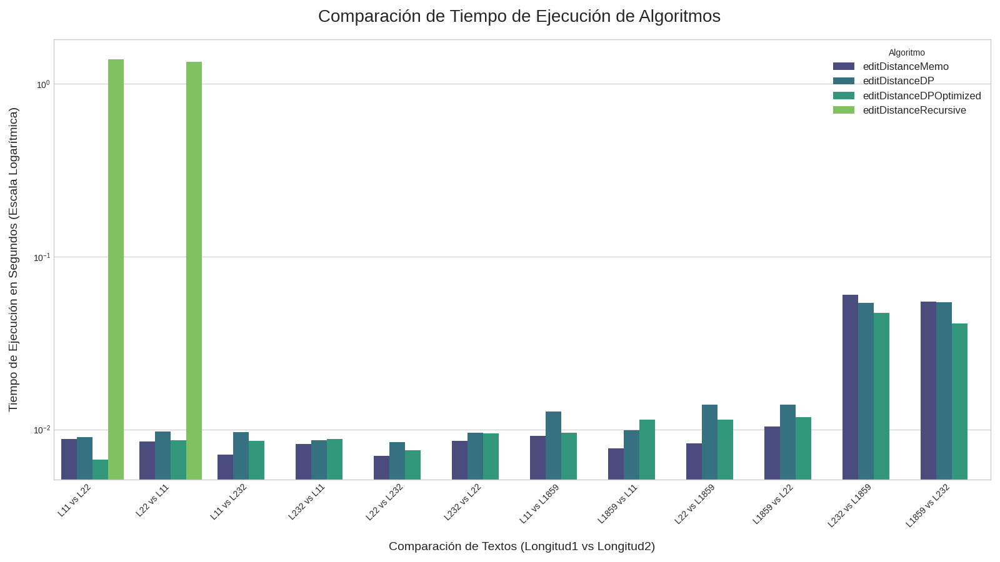

# Tarea 2: Delete Insert Edit Distance




## Descripción

Este repositorio contiene los archivos relacionados con la [tarea 2](doc/tarea2.pdf)
del curso Análisis de Algoritmos (2025-1).

## Integrantes

- Alonso Bustos
- Gabriela Eweldt
- Constanza Cristinich

## Informe

Desarrollo utilizando overleaf: [enlace](https://www.overleaf.com/read/wmmcspxqnzsr#c7e606)

## Uso

Compilar, medir y graficar todo:

```bash
./medir_graficar_todo.sh
```

Luego, todos los archivos generados estarán el directorio `build/`
